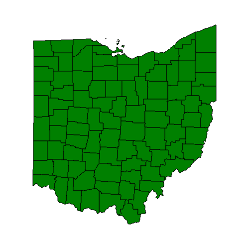

PyMapKit QuickStart Guide
=

Welcome to the PyMapKit QuickStart Guide. This guide gives a quick introduction
to using PyMapKit, and will get you started making maps. 

There are two requirements before we proceed.

1. A PyMapKit installion (Click here for the installation guide).

2. A geospatial dataset to visualize (Click here for sample dataset). 


```
QuickStart Outline
1. A Minimal Application
    - Code Snippet
    - Line by Line Explanation

2. Changing Map Parameters
    - Changing scale
    - Changing location
    - Changing projection

3. Visualizing Vector Data
    - Available input types
    - 

4. Visualizing Raster Data

5. Displaying Map Tiles

6. Changing Background display

7. Add Titles, labels, and other text.

```


## A Minimal Application
One of the simplest possible PyMapKit scripts looks like this. 
The following snippet generates a map in the PNG format from a geojson file.

```python
import pymapkit as pmk

m = pmk.Map()

counties = pmk.VectorLayer.from_path("./data/ohio_counties.geojson")
m.add(counties)
counties.focus()

m.render('MyMap.png')
```

Running this code generates this image:




So what happened there? 
Let us go through it line by line.

```python
import pymapkit as pmk
```
This imports the PyMapKit library to that it is accessible as "pmk".

```python
m = pmk.Map()
```
This creates a Map object called "m". 
PyMapKit's main object is the Map object.
It hosts map layers, holds parameters and settings, and controls rendering.
You could name it "map" instead, but that is not recommended because "map" is a
built-in function. 
Naming it "map" would overwrite that function, and could cause unwanted 
behaviors.


```python
counties = pmk.VectorLayer.from_path("./data/ohio_counties.geojson")
```
This line creates a VectorLayer object from a geojson file called counties. 
Not much can be done with this layer before we add it to a Map object.
For more infomation about vector layers, check out the "Visualizing Vector 
Data" section below.


```python
m.add(counties)
```
Here we add the new layer to the map object. 

```python
counties.focus()
```
This line tells the map to change the location and scale to showcase the 
counties layer. If this is not run, the map will not automatically focus on 
your data.

```python
m.render('MyMap.png')
```
Finally, we tell the map to render and send the rendered image to an output 
file.


---
---
---

 ## Changing Map Parameters

### Changing Location
### Changing Scale

### Changing Projection


## Visualizing Vector Data

To create a new 

```python
counties = pmk.VectorLayer.from_path("./data/ohio_counties.geojson")
```